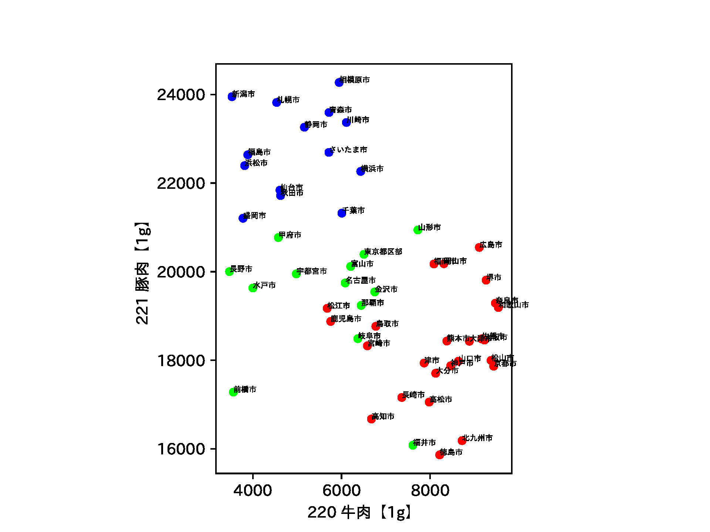
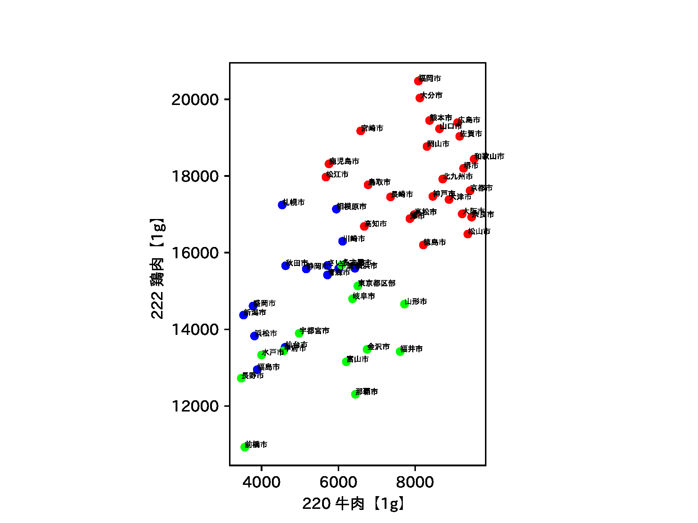
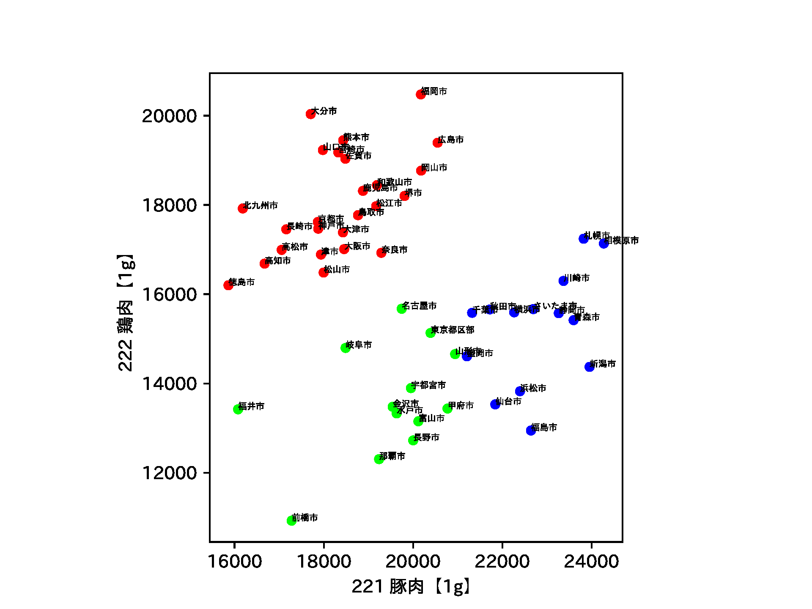

# 社会情報科学概論の図表作成用

## 図表

- 回帰: アイスクリーム・シャーベット(購入金額) vs 日最高気温の月平均
- クラスタリング: 都市別の肉類購入量 (5年平均)

## データ

### 家計調査データ（お菓子）

e-Stat https://www.e-stat.go.jp/statistics-by-theme/

1. e-Stat > 分野から探す > 家計調査 > データベース > 家計収支編-二人以上の世帯-「月次」 > 品目分類 (最新の年のもの)「総数：金額」 – DB
1. 表示項目選択で「品目分類」の数字をクリック > 全解除して必要なものだけ選択 > 表示を更新
   1. いったん複数選んでおき「複数項目の選択／解除」をクリック
   2. お菓子関係すべて
2. 時間軸（月次） > 全解除して必要な月を選択 > 表示を更新
   1. 10,11年程度 (2009.1 - 2020.1など)
4. CSVをダウンロード
   1. 世帯区分「二人以上の世帯(2000年～)」地域区分「全国」が選択されていることを確認して「ダウンロード」をクリック
   2. ダウンロード範囲: ページ上部の選択項目
   3. ファイル形式: CSV形式 (クロス集計表形式)
   4. ヘッダの出力: 出力しない
   5. コードの出力: 出力しない
   6. 「注釈を表示する」のチェックを外し「桁区切りを使用しない」を選択

### 家計調査データ（牛・豚・鶏肉）

1. e-Stat > 分野から探す > 家計調査 > データベース > 家計収支編-二人以上の世帯-「年次」 > 品目分類 (最新の年のもの) 「総数：数量」- DB
2. 「品目分類」で牛肉・豚肉・鶏肉を、「時間軸（月次）」で期間を選択
   1. 2014-2019 としておく
3. 「世帯区分」で「二人以上の世帯(2000年～)」」
4. CSVをダウンロード
   1. ダウンロード範囲: 全データ
   2. ファイル形式: CSV形式 (クロス集計表形式)
   3. ヘッダの出力: 出力しない
   4. コードの出力: 出力しない
   5. 「注釈を表示する」のチェックを外し「桁区切りを使用しない」を選択

### 気象庁データ

過去の気象データ・ダウンロード https://www.data.jma.go.jp/gmd/risk/obsdl/index.php

1. 「地点を選ぶ」で興味のある地点を選択（「東京」など）
1. 「項目を選ぶ」月別値 > 興味のある項目にチェックを入れる
    - 日最高気温の月平均
    - 日平均気温25°C以上の日数
    - 降水量の月合計
    - 月平均相対湿度
1. 「期間を選ぶ」で期間を選択
1. CSVファイルをダウンロード

## 実行結果

### 回帰 ([regression.py](regression.py))

- 毎月のアイスクリームの購入金額と気温の関係
  - 参考: アイスクリームの売れ方 (回帰): [奥村先生のページ](https://oku.edu.mie-u.ac.jp/~okumura/stat/160118.html)
- 毎月の日数を考慮（うるう年も考慮）

<table>
<tr>
<td></td>
<td></td>
</tr>
</table>

### 重回帰 ([mult_regression.py](mult_regression.py))

- チョコレート菓子と気温や年の関係（1回生後期「確率・統計」用）

### クラスタリング ([clustering.py](clustering.py))

- 牛肉，豚肉，鶏肉の政令指定都市や県庁所在市ごとの購入量(g)をクラスタリングし，日本地図にプロットすることで，地域による生鮮肉の購入の特徴を可視化する
- [★クラスタリング結果を地図へ](https://hkawash.github.io/sis-intro/map-clustering_2014-2018.html)
  - [アマノ技研](https://amano-tec.com/)公開の[全国の地方公共団体の県庁所在地・位置座標データ](https://amano-tec.com/data/localgovernments.html)を使用（2018-10-18版）
  - 地図へのプロットは folium 使用 (東京都特別区13100の座標は東京都千代田区13101としている)
  - 西日本は牛肉・鶏肉（生鮮肉自体の購入量が多い）
  - 東日本は豚肉の購入量が多い

<table>
<tr>
<td></td>
<td></td>
<td></td>
</tr>
</table>

### 相関

#### 生鮮肉の購入量の相関 ([correlation_meat.py](correlation_meat.py))

- 相関係数の計算
  - 牛肉と豚肉の購入量には負の相関
  - 牛肉と鶏肉の購入量には正の相関
- 散布図のプロット (seaborn の pairplot)

#### 気温と購入金額の相関 ([correlation_temp.py](correlation_temp.py))

- アイスと気温には正の相関
- チョコと気温には負の相関 (2月は外れ値)
- [★お菓子については全てプロット（さらに月ごとに点を色分け）した結果](corr-temp.md)

#### 相関係数の計算の説明用の図作成 ([correlation_artificial.py](correlation_artificial.py))

- 人工的な数学，物理の点のデータの散布図
- 偏差積の説明用

#### 疑似相関の説明用のネットワーク図 ([relation_network.py](relation_network.py))

- networkx と graphviz で，第三の変数の介在を説明するためのネットワーク図を出力

#### 非単調なデータでのスピアマンの順位相関係数 ([nonlinear_uncorrelated.py](nonlinear_uncorrelated.py))

- y=x^2 の関係
