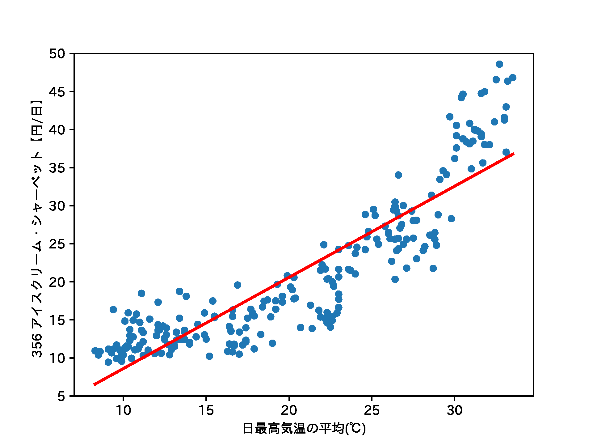
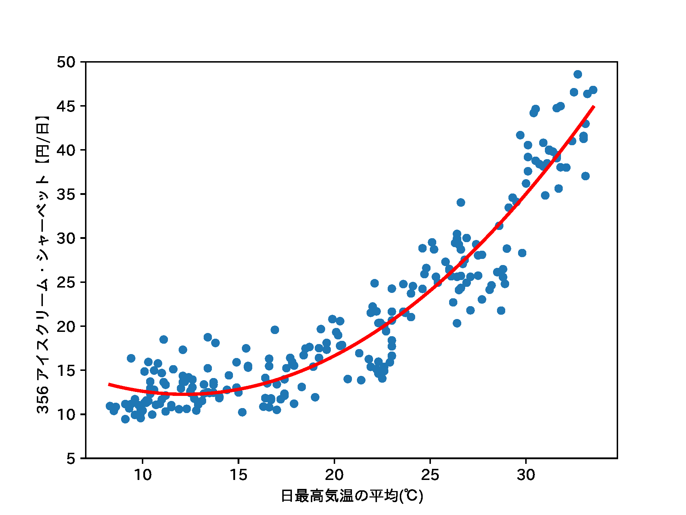

# 概論図表作成用

## 図表

- 回帰: アイスクリーム・シャーベット(購入金額) vs 日最高気温の月平均
- クラスタリング: 都市別の肉類購入量 (5年平均)

## データ

### 家計調査データ

1. e-Stat > 分野から探す > 家計調査 > データベース > 家計収支編-二人以上の世帯-月次 > 品目分類 (最新の年のもの) (総数：金額) – DB
1. 表示項目選択で「品目分類」の数字をクリック > 全解除して必要なものだけ選択 > 表示を更新
1. CSVをダウンロード

### 気象庁データ

過去の気象データ・ダウンロード https://www.data.jma.go.jp/gmd/risk/obsdl/index.php

1. 「地点を選ぶ」で興味のある地点を選択（「東京」など）
1. 「項目を選ぶ」月別値 > 興味のある項目にチェックを入れる
    - 日最高気温の月平均
    - 日平均気温25°C以上の日数
    - 降水量の月合計
    - 月平均相対湿度
1. 「期間を選ぶ」で期間を選択
1. CSVファイルをダウンロード

## 実行結果

### 回帰

### クラスタリング

- [クラスタリング結果を地図へ](https://hkawash.github.io/sis-intro/map-clustering_2014-2018.html)

## 参考

- アイスクリームの売れ方 (回帰): [奥村先生のページ](https://oku.edu.mie-u.ac.jp/~okumura/stat/160118.html)
