# 月ごとの平均気温（東京）と全国のお菓子の購入金額の関係 (10年分，120点)

<table>
<tr>
<td>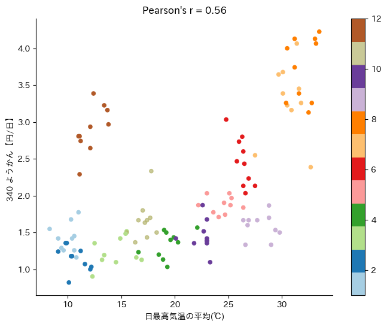</td>
<td>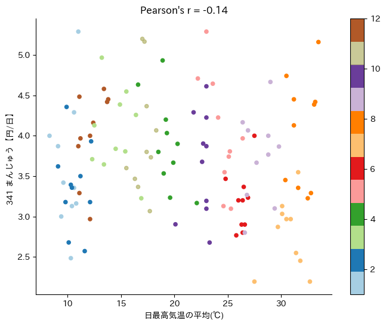</td>
<td>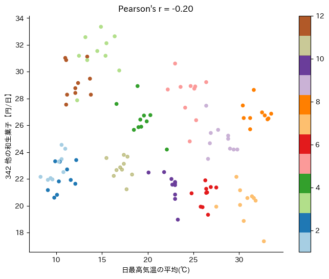</td>
</tr><tr>
<td>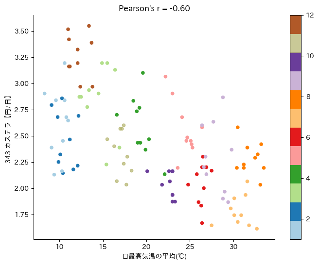</td>
<td>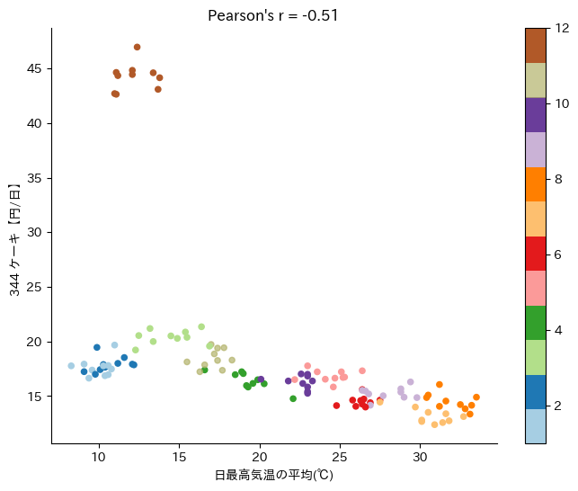</td>
<td>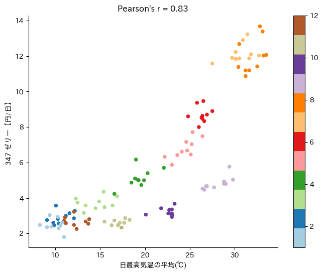</td>
</tr><tr>
<td>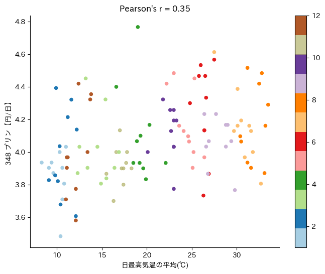</td>
<td>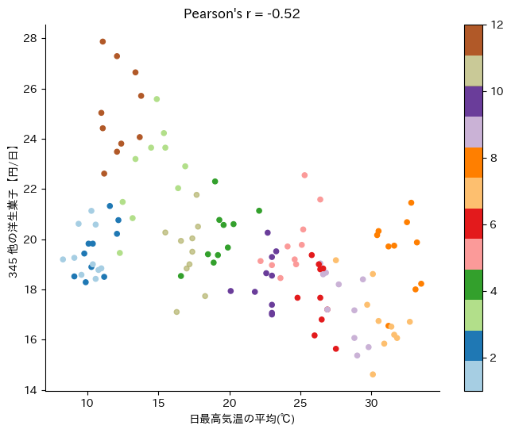</td>
<td>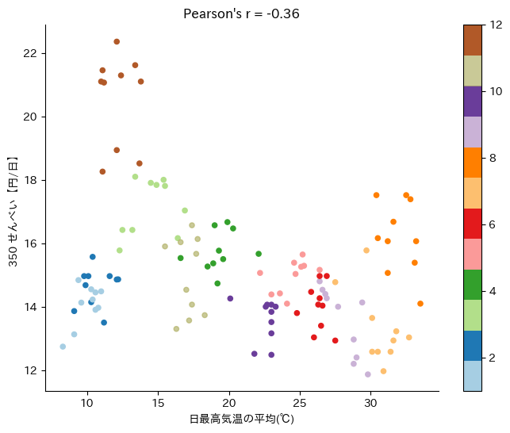</td>
</tr><tr>
<td>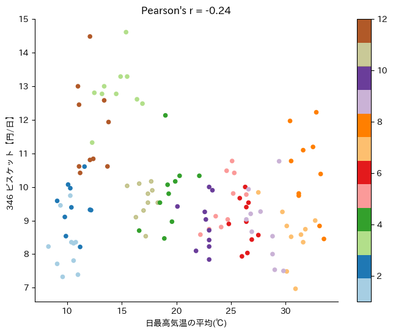</td>
<td>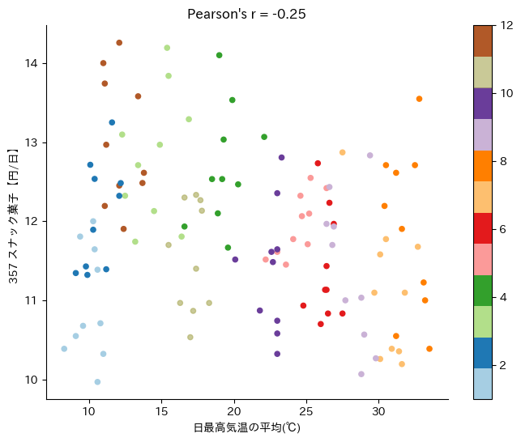</td>
<td>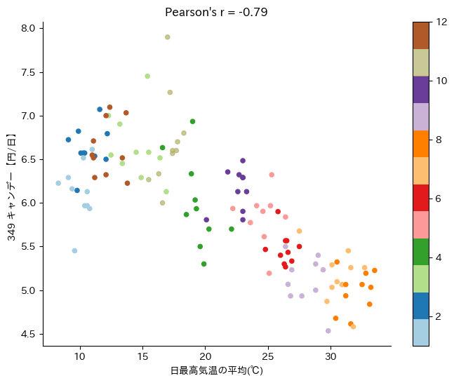</td>
</tr><tr>
<td>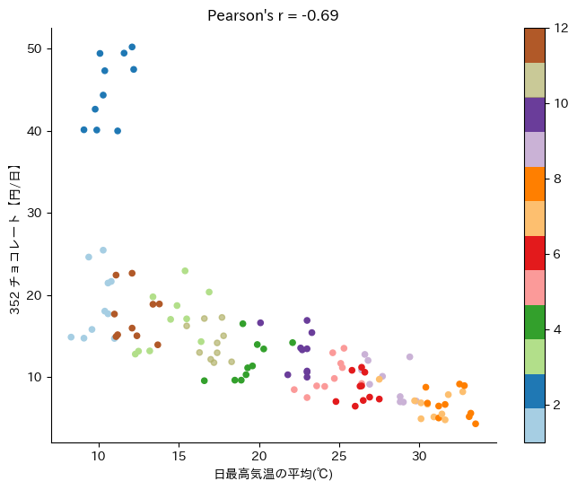</td>
<td>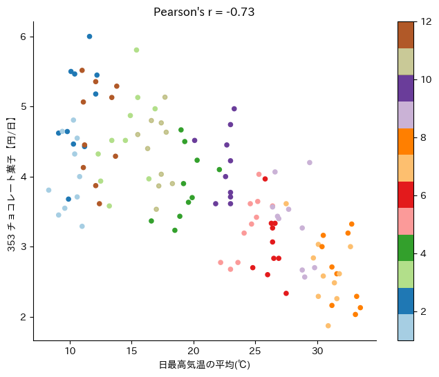</td>
<td>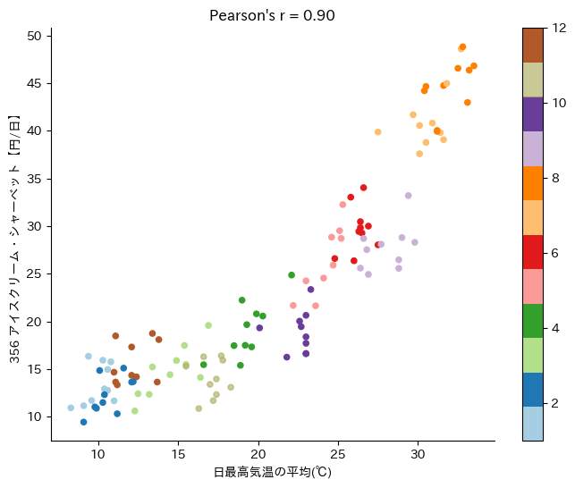</td>
</tr>
</table>

